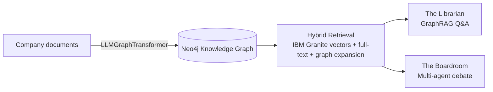
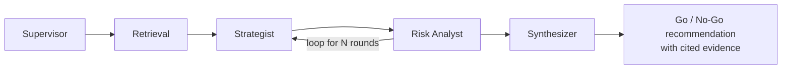

# Atlas: GraphRAG Decision Intelligence for Teams

Atlas turns scattered company documents into a queryable knowledge graph, then puts two
AI co-workers on top of it: a **Librarian** that answers factual questions with evidence,
and a **Boardroom** that debates decisions from both sides before making a reccomendation.

## Problem Statement

Organizations run on knowledge that lives in disconnected documents — project briefs, org
charts, budgets, OKRs, client contracts. The facts that matter for a decision are spread
across many of them, so answering a cross-cutting question ("if Project Zeta goes down,
which clients are affected, and who owns the fix?") or pressure-testing a proposal ("should
we fully fund Project Gamma?") means a person manually stitching the pieces together. That
work is slow, easy to get wrong, and rarely surfaces the risks hiding one or two hops away
in the data. Teams end up making consequential calls on an incomplete picture.

## Solution

Atlas transforms unstructured company data into a structured **Knowledge Graph** and layers
intelligent, outcome-driven tools on top of it. It has three interfaces:

1. **Atlas** — Ingest documents and visualize the resulting entity/relationship graph.
2. **The Librarian** — Hybrid GraphRAG interface for factual querying (vector + full-text + Cypher).
3. **The Boardroom** — Multi-agent debate system (Strategist vs. Risk Analyst) that evaluates
   an idea against the graph and produces an evidence-cited recommendation.

Instead of hunting through documents, a user asks a question or proposes a decision, and
Atlas reasons over the connected graph to deliver a grounded answer — reducing repetitive
lookup work and improving the quality of decisions.

## Selected Challenge Theme

**Wild Card Challenge.** Atlas is a **decision-intelligence platform with AI co-workers**: it
uses AI as a true collaborator that helps a team *plan, decide, and coordinate* rather than
just complete isolated tasks. The Librarian removes repetitive knowledge-lookup work, and the
Boardroom orchestrates a multi-agent workflow that improves decision-making by forcing an
evidence-based debate before a recommendation is made.

## AI Approach & Architecture

**AI is the core of the product**, used in three places:

- **Knowledge Graph construction** — LangChain's `LLMGraphTransformer` extracts a typed
  ontology (Employees, Projects, Departments, Clients, OKRs, Budgets and their relationships)
  from raw text and loads it into Neo4j.
- **Hybrid retrieval (GraphRAG)** — **IBM Granite embeddings** (`granite-embedding-30m-english`,
  run locally) power vector search over document chunks, combined with full-text search and
  **graph expansion** over `MENTIONS` relationships, plus LLM-generated **Cypher** for
  structured facts.
- **Multi-agent reasoning** — a **LangGraph** state machine runs a debate between a Strategist
  and a Risk Analyst, both grounded strictly in retrieved graph evidence, then a Synthesizer
  produces the final verdict.



The Boardroom workflow (LangGraph):



**Model roles:** IBM Granite handles embeddings/vector search locally (no embedding API key
required); Google Gemini handles chat/reasoning across the three surfaces; LangChain and
LangGraph provide orchestration; Neo4j AuraDB stores the graph.

## How IBM Bob Was Used

**IBM Bob was the primary development tool for this project.** The full-stack application —
FastAPI backend, Neo4j integration, the hybrid GraphRAG retrieval pipeline, the LangGraph
multi-agent debate, and the Next.js/React frontend — was designed, scaffolded, and iterated
on with IBM Bob. Bob was used to:

- Scaffold the backend/frontend structure and wire up the services, routers, and API client.
- Implement and refine the GraphRAG retrieval and the multi-agent Boardroom debate graph.
- Refactor and extend features — for example, migrating vector embeddings from a hosted
  provider to a **local IBM Granite** model while keeping the rest of the pipeline unchanged.
- Explore the codebase, debug, and keep documentation in sync.


## Tech Stack
- **Frontend**: Next.js, React, Tailwind CSS
- **Backend**: Python, FastAPI
- **Database**: Neo4j AuraDB
- **LLM (chat/inference)**: Google Gemini API
- **Embeddings**: Local IBM Granite model (`ibm-granite/granite-embedding-30m-english`) via sentence-transformers — no embedding API key required
- **Orchestration**: LangChain, LangGraph

## Project Structure
```
/
├── frontend/          # Next.js application (default port 3000)
├── backend/           # FastAPI application (default port 8000)
├── .env.example       # Environment variables template
└── README.md
```

## Prerequisites
- Node.js 18+
- Python 3.10+
- A Neo4j AuraDB instance
- A Google Gemini API key (for chat/inference)

Vector embeddings run locally via an IBM Granite model. It is downloaded from
HuggingFace automatically on first ingestion/query (~120 MB) and runs on CPU — no
embedding API key is needed.

## Environment Variables
Copy `.env.example` to `.env` (in the project root) and fill in your credentials:

```bash
cp .env.example .env
```

Required values:
- `NEO4J_URI`
- `NEO4J_USERNAME`
- `NEO4J_PASSWORD`
- `GEMINI_API_KEY` (chat/inference only)

The remaining variables have sensible defaults, including:
- `EMBEDDING_MODEL` (default `ibm-granite/granite-embedding-30m-english`) — the local
  IBM Granite embedding model used for vector search. Swap it for any other Granite
  embedding model (e.g. `ibm-granite/granite-embedding-english-r2`) and the Neo4j
  vector index is rebuilt automatically at the new dimensionality on next ingestion.
- `EMBEDDING_DEVICE` (default `cpu`; set to `cuda`/`mps` if you have a GPU)

> **Switching embedding models** rebuilds the vector index and clears old vectors, so
> ingested documents are re-embedded on the next query/ingestion. If you previously
> ingested data with a different embedding model, re-run ingestion (or the `embed`
> backfill) to repopulate vectors.

## Running the App

You can run the automated setup once with `./setup.sh`, or follow the steps below.

### 1. Backend (Terminal 1)
```bash
cd backend
python -m venv venv
source venv/bin/activate          # On Windows: venv\Scripts\activate
pip install -r requirements.txt
uvicorn main:app --reload         # serves http://localhost:8000
```

The API docs are available at http://localhost:8000/docs once the server is running.

### 2. Frontend (Terminal 2)
```bash
cd frontend
npm install
npm run dev                       # serves http://localhost:3000
```

Open **http://localhost:3000** in your browser.

## Managing the Knowledge Graph

The graph starts empty. Use any of the options below to populate, reset, or reload it.
All `curl` examples assume the backend is running on `http://localhost:8000`.

### Ingest the mock company documents
The repo ships with a set of interconnected sample documents (`backend/mock_data.py`)
describing the fictional company *Acme Analytics*.

**Option A — script (clears the graph first, then ingests all samples):**
```bash
cd backend
source venv/bin/activate
python test_ingestion.py
```

**Option B — API (append the samples, keeping existing data):**
```bash
curl -X POST "http://localhost:8000/api/ingest/samples"
```

### Delete a single document
Removes one ingested document (all of its text chunks) **and** prunes the entities that
were added *only* by that document. Entities that other documents also mention (e.g.
shared people or projects) are preserved. From the **Atlas** tab, open **"Add documents"**
and use the delete button next to a document in the **Ingested documents** list, or:

```bash
# List ingested documents (titles + chunk/entity counts)
curl "http://localhost:8000/api/ingest/documents"

# Delete one document by title (undo an upload)
curl -X DELETE "http://localhost:8000/api/ingest/documents?title=project-omega-expansion-brief"
```

### Clear the graph
Deletes **all** nodes and relationships.

```bash
curl -X DELETE "http://localhost:8000/api/ingest/clear"
```

### Clear and re-ingest the mock documents in one step
```bash
curl -X POST "http://localhost:8000/api/ingest/samples?clear_existing=true"
```

You can also do this from the **Atlas** tab in the UI: open **"Add documents"**, drag in
(or browse to) a `.txt`/`.md` file, and click **Ingest document**. Check **"Replace
existing graph"** first to wipe the graph before ingesting.

### Upload a sample text document
A ready-to-ingest sample document lives at
`sample_documents/project-omega-expansion-brief.md`. It introduces a new initiative
(*Project Omega*) that cross-references the existing *Acme Analytics* graph — new hires
reporting to existing managers, a new client (*LogiCore*), dependencies on *Project Zeta*
and *Project Alpha*, and budget/OKR ties. Upload it via the **Atlas** tab, or:

```bash
curl -X POST "http://localhost:8000/api/ingest/upload" \
  -F "file=@sample_documents/project-omega-expansion-brief.md" \
  -F "clear_existing=false"
```

### Check graph status
```bash
curl "http://localhost:8000/api/ingest/status"
```

## API Endpoints

### Ingestion
- `POST /api/ingest/` — Ingest raw text (`{ "text": "...", "title": "...", "clear_existing": false }`)
- `POST /api/ingest/upload` — Upload a `.txt`/`.md` document (multipart form: `file`, optional `title`, `clear_existing`)
- `GET /api/ingest/samples` — List the available mock documents
- `POST /api/ingest/samples?clear_existing=<bool>` — Ingest all mock documents
- `GET /api/ingest/status` — Node/relationship/embedding counts
- `GET /api/ingest/graph?limit=<n>` — Nodes and links for visualization
- `POST /api/ingest/embed` — Backfill embeddings for documents missing vectors
- `GET /api/ingest/documents` — List ingested documents (grouped by title) with chunk/entity counts
- `DELETE /api/ingest/documents?title=<title>` — Delete one document and the entities it uniquely added
- `DELETE /api/ingest/clear` — Delete all data

### Librarian
- `POST /api/librarian/query` — Ask a question (`{ "query": "..." }`)

### Boardroom
- `POST /api/boardroom/debate` — Run a debate and return the full result
- `POST /api/boardroom/debate/stream` — Stream a debate live (Server-Sent Events)

### Health
- `GET /` — Basic health check
- `GET /health` — Detailed health check (includes Neo4j connectivity)

## Good Test Questions based on Mock Data:

Librarian (GraphRAG)

- Who works on Project Beta, and who does each of them report to?
- If Project Zeta had an outage, which clients would ultimately be affected 
- What is our total annual recurring revenue, and which client contributes the most?
- Who represents the biggest key-person risk in Engineering, and why?

Boardroom (multi-agent debate)

- We should approve the additional $500K to fully fund Project Gamma?
- We should prioritize HealthCorp's SSO customization and SOC 2 work above all other Project Alpha features?
